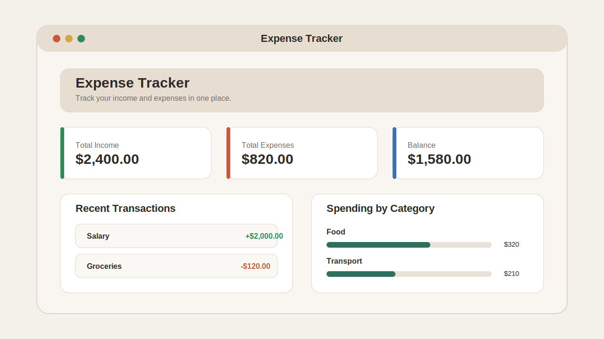

# Expense Tracker

A simple and beginner-friendly expense tracker built with HTML, CSS, and JavaScript. This project helps users add income and expenses, track their balance, filter records, and export data in a clean interface.

## Live Demo

[View the project here](https://akshat-create.github.io/Expense-Tracker/)

## Preview

## Tech Stack

- HTML5
- CSS3
- JavaScript
- Local Storage
- GitHub Pages

## Features

- Add income and expense transactions
- Show total income, total expenses, and current balance
- Filter transactions by category, type, and search text
- Delete a single transaction when needed
- Clear all saved transactions
- Export transaction history as a CSV file
- Save data in the browser using `localStorage`

## Project Structure

- `Index.html` - main page structure
- `style.css` - layout and design
- `script.js` - transaction logic and storage handling
- `assets/expense-tracker-preview.svg` - preview image for the README

## How to Run Locally

1. Clone the repository.
2. Open the project folder.
3. Run `Index.html` in your browser.

## Why This Project

This project was built to stay simple, readable, and beginner-friendly. The code avoids unnecessary complexity so it is easier to learn from and improve later.
